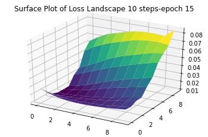
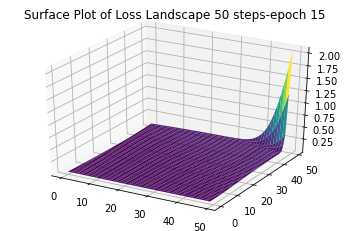
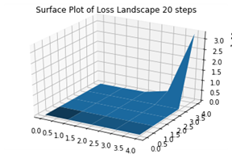
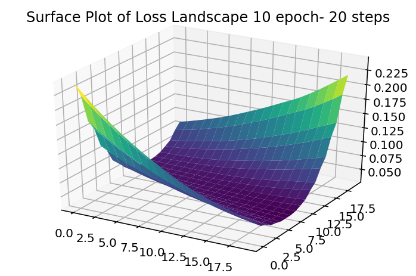
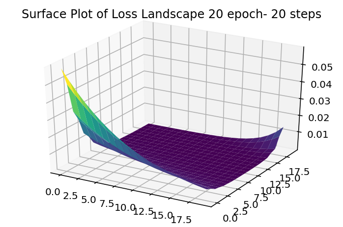
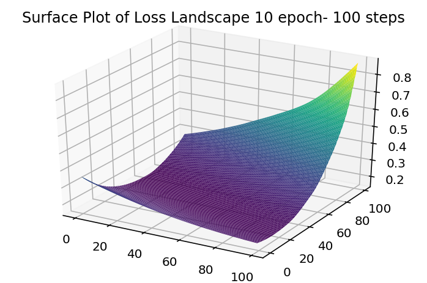
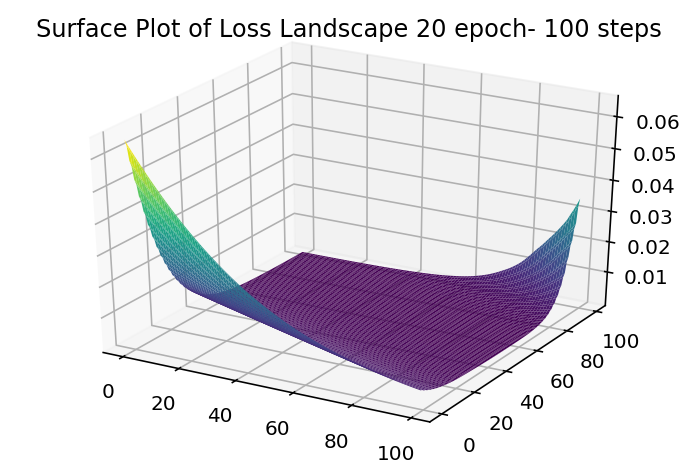

# Loss-surface-landscapeHW

This is the repository related to my assignment visualizing the loss surface landscape.
I used pytorch implementation of convolutional neural network to visualize the loss surface. The project done on google Colab (provide a GPU for training the model).
I have done the project in two different datasets. Big datasets consist of traffic signs of 52 classes, and the Mnist handwritten. 

## Visualizing loss surface

we define a Loss metric over data X and labels y. The `loss_landscapes.model_metrics` package contains a number of metrics that cover common use cases, evaluates a loss function.
```
import loss_landscapes
import loss_landscapes.metrics

x, y = next(iter(testLoader))
metric = loss_landscapes.metrics.Loss(criterion, x, y)
```  
return a 2-dimensional array of loss values, and computing the loss at a number of points on the plane defined by the two array:
```
loss_data_fin = loss_landscapes.random_plane(
    model_final.cpu(), 
    metric,
    8, 
    STEPS, 
    normalization='filter', 
    deepcopy_model=True
)
```
## Results 
### Traffic Signs







### Mnist

  

 

  

 
## Some of the potential candidate parameters that may affect the loss surface are:
Some of the potential candidate parameters that may affect the loss surface are:
* Number of epochs: as for a too low or too high number of epochs the network may underfit or overfit the data, however finding the best epochs number may give a near to truth surface.
* Model depth: the deeper the network is, the more complex the loss function will be.
* Layer’s order:the backpropagation literally defines the loss function, the order of the layers is critical.
* Plotting steps: the higher the steps the smoother our plot is.

